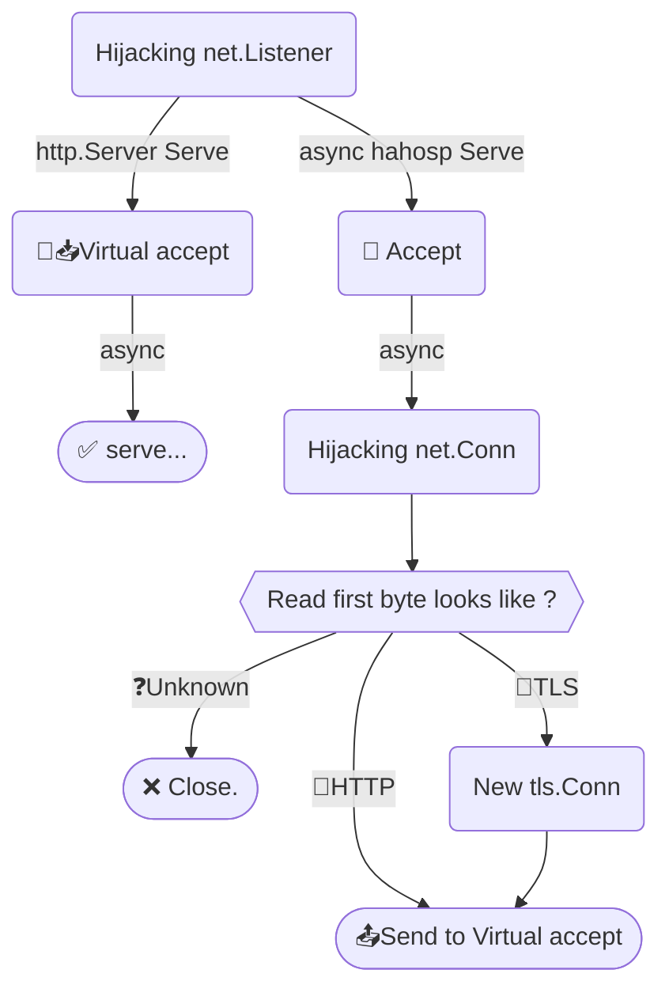

# HTTP And HTTPS On Same Port

🌐 Listen HTTP and HTTPS on the **same port** using Golang.

> If you only need HTTP redirect to HTTPS, recommended use [github.com/bddjr/hlfhr](https://github.com/bddjr/hlfhr)

## Setup

```
go get -u github.com/bddjr/hahosp@latest
```

```go
srv := &http.Server{
    Addr:    ":5688"
    // Use [hahosp.HandlerSelector]
    Handler: &hahosp.HandlerSelector{
        HTTPS: http.HandlerFunc(func(w http.ResponseWriter, r *http.Request) {
            io.WriteString(w, "ok\n")
        }),
        HTTP: nil, // If nil, redirect to HTTPS.
    },
}

// Use [hahosp.ListenAndServeTLS]
err := hahosp.ListenAndServeTLS(srv, "localhost.crt", "localhost.key")
```

---

## VS

`github.com/bddjr/hahosp` VS [`github.com/bddjr/hlfhr`](https://github.com/bddjr/hlfhr)

| Feature | hahosp | hlfhr |
| ---- | ---- | ---- |
| WebSocket on HTTP (not HTTPS) | ✅ | ❌ Unsupport `http.Hijacker` |
| Keep alive on HTTP (not HTTPS) | ✅ | ❌ |
| Without modify type `http.Server` | ✅ | ❌ Need modity to `hlfhr.Server` |
| Redirect to HTTPS without modify `Server.Handler` | ❌ Need modify to `hahosp.HandlerSelector` | ✅ |
| Listen 80 redirect to 443 | ❌ | ✅ Need config |
| Without modify `Server.ListenAndServeTLS` | ❌ Need modify to `hahosp.ListenAndServe` | ✅ |

---

## Logic


```mermaid
flowchart TD
	VirtualListener("Hijacking net.Listener")
    VirtualAccept("🔄📥Virtual accept")
    Accept("🔄 Accept")
    Serve(["✅ serve..."])
	LooksLike{{"Read first byte looks like ?"}}
	Close(["❌ Close."])
    HijackingNetConn("Hijacking net.Conn")
    SentToVA(["📤Send to Virtual accept"])
    NewTLS("New tls.Conn")

    VirtualListener -- "http.Server Serve" --> VirtualAccept -- "async" --> Serve
    VirtualListener -- "async hahosp Serve" --> Accept -- "async"  --> HijackingNetConn --> LooksLike
    LooksLike -- "❓Unknown" --> Close
    LooksLike -- "📄HTTP" --> SentToVA
    LooksLike -- "🔐TLS" --> NewTLS --> SentToVA
```
