# HTTPS And HTTP On Same Port

Listen HTTPS and HTTP on same port.

> [!IMPORTANT]
> If you only need redirect to HTTPS, please use https://github.com/bddjr/hlfhr

---

## Get

```
go get github.com/bddjr/hahosp
```

---

## Example

```go
srv := &http.Server{
    Addr:    ":5688"
    Handler: http.HandlerFunc(func (w http.ResponseWriter, r *http.Request) {
        if r.TLS != nil {
            io.WriteString(w, "You'r using HTTPS\n")
        } else {
            io.WriteString(w, "You'r using HTTP\n")
        }
    }),
}

err := hahosp.ListenAndServe(srv, "localhost.crt", "localhost.key")
```

---

## Logic

```mermaid
flowchart TD
	VirtualListener("Hijacking net.Listener")
    VirtualAccept("🔄📥Virtual accept")
    Accept("🔄 Accept")
    Serve(["✅ serve..."])
	LooksLike{{"Read first byte looks like ?"}}
	Close(["❌ Close."])
    SentToVA(["✅📤Send to Virtual accept"])
    NewTLS("New tls.Conn")

    VirtualListener -- "http.Server Serve" --> VirtualAccept -- "async" --> Serve
    VirtualListener -- "async hahosp Serve" --> Accept -- "async"  --> LooksLike
    LooksLike -- "❓Unknown" --> Close
    LooksLike -- "📄HTTP" --> SentToVA
    LooksLike -- "🔐TLS" --> NewTLS --> SentToVA
```



---

## Test

```
git clone https://github.com/bddjr/hahosp
cd hahosp
./run.sh
```

---

## Reference

https://github.com/bddjr/hlfhr

---

## License

[BSD-3-clause license](LICENSE.txt)
